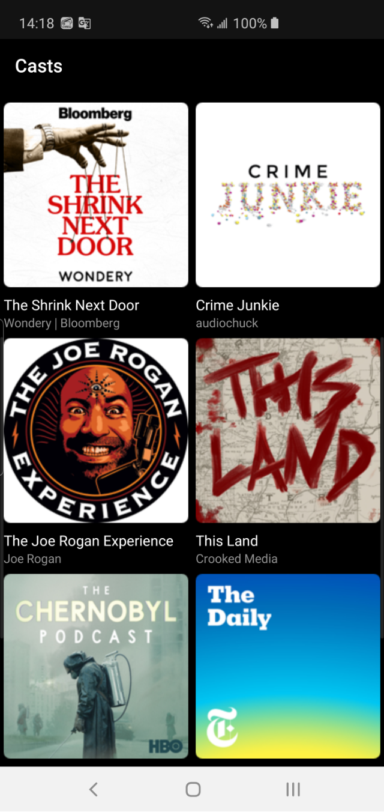
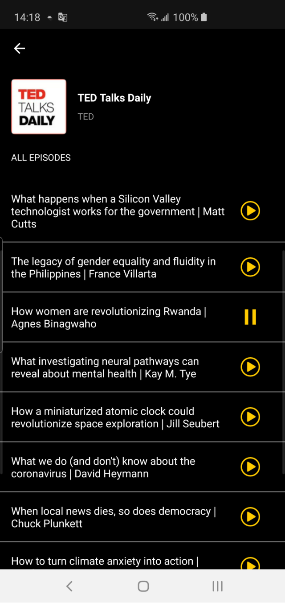
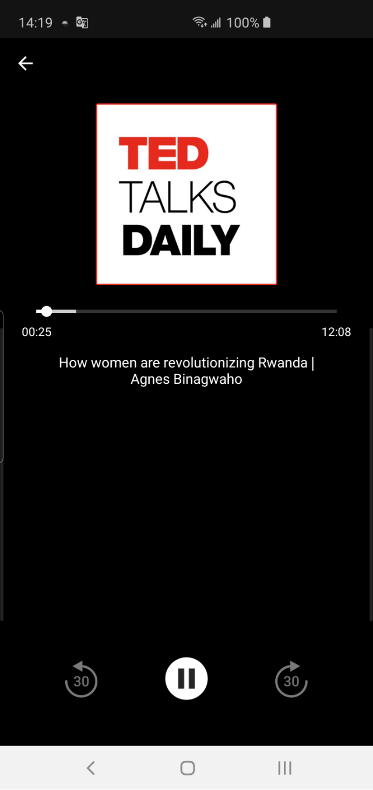
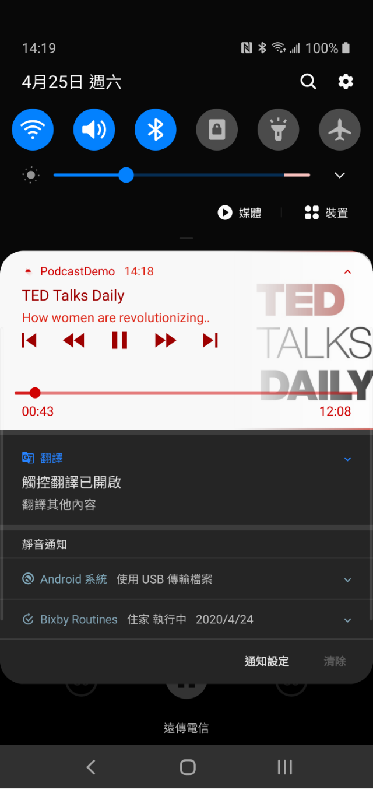

# PodcastDemo
App demo for Podcast player.

Using Kotlin / MVVM / koin / coroutine / RxJava2 / ExoPlayer / Epoxy

## Demo 截圖
  1. 首頁
	
  
  
  2. Detail
	
  
  
  3. Player
  
  
  
  4. Meida Notification supported.
  
  
